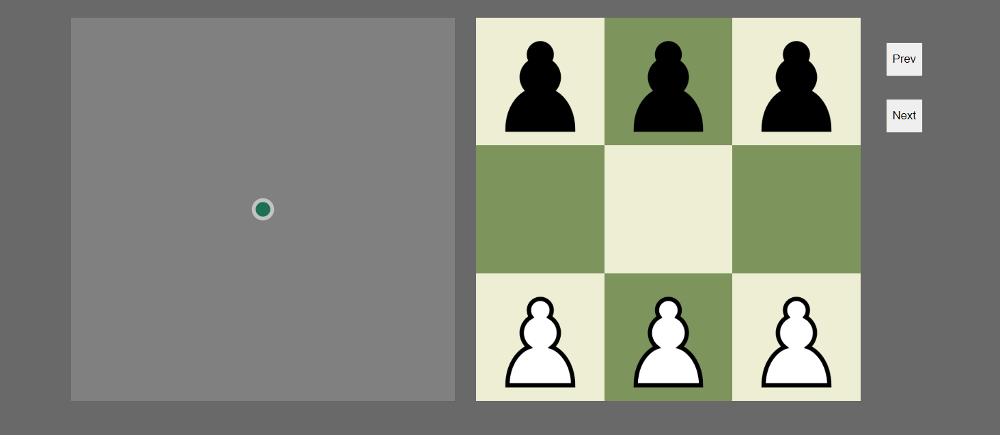
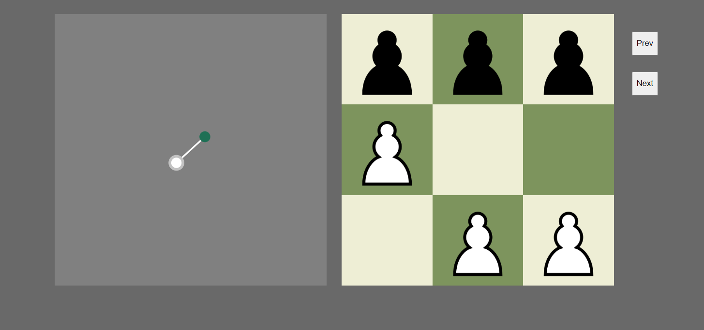
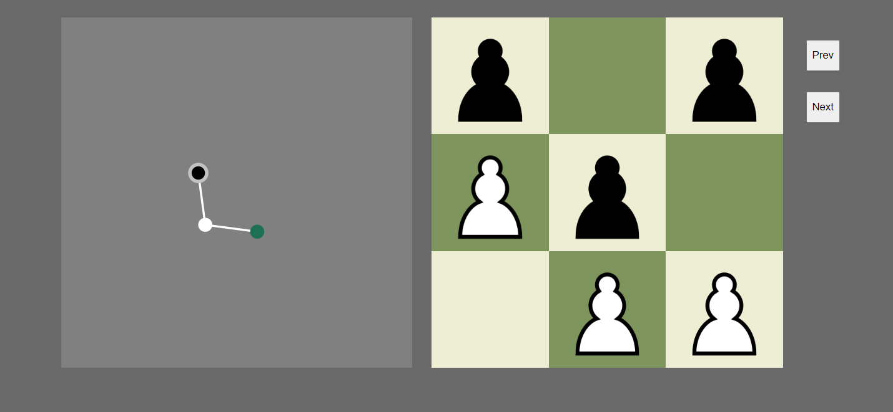
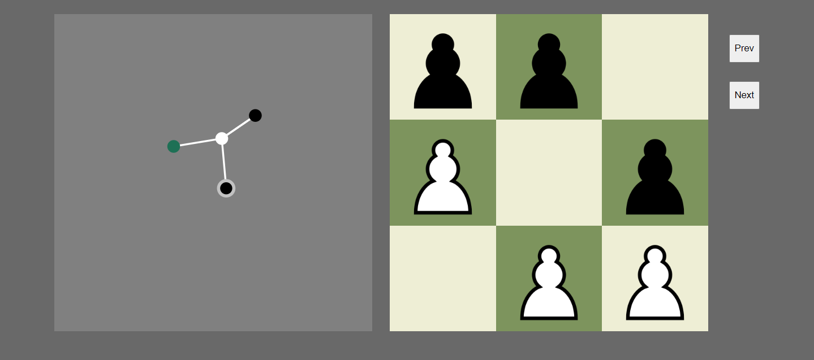

# Hexapawn-UI

An implementation of Hexapawn, the worlds most primitive ai.

The left chart is the game tree. All your moves in the game are represented in the tree. You can click on the tree nodes to go to the respective moves.

## run locally

In the project directory, you can run:

### `npm start`

Runs the app in the development mode.\
Open [http://localhost:3000](http://localhost:3000) to view it in your browser.

### Here are some examples.

